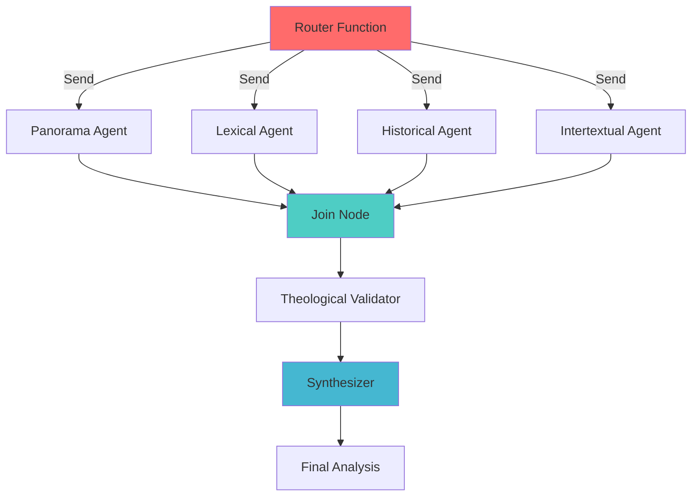

# 📖 Theological LangGraph Agent

> A production-grade multi-agent system for deep biblical analysis using LangGraph and FastAPI

[](https://github.com/langchain-ai/langgraph)
[](https://fastapi.tiangolo.com/)
[](https://streamlit.io/)
[](https://www.python.org/)

A sophisticated theological analysis system that leverages **LangGraph's multi-agent orchestration** to provide comprehensive biblical exegesis through parallel agent execution and structured synthesis.

## 🎯 Why This Project?

Biblical exegesis traditionally requires hours of manual research across:
- Lexicons (Strong's, BDB, Louw-Nida)
- Theological commentaries
- Historical context
- Intertextual references

**This system automates multi-dimensional analysis while maintaining academic rigor.**

**Problem Solved:**
- ❌ Time-consuming manual research
- ❌ Inconsistent methodology
- ❌ Limited accessibility for non-scholars

**Solution:**
- ✅ 2-minute comprehensive analysis
- ✅ Structured theological validation
- ✅ Academic-grade output for anyone

**Real-World Impact:** Enables pastors, seminary students, and Bible study leaders to produce scholarship-level insights without extensive theological training.

## 🌟 Key Features

### Multi-Agent Architecture
- **Asynchronous Agent Execution**: Parallel processing using LangGraph's `Send` API for optimal throughput
- **Scatter-Gather Pattern**: Dynamic routing based on selected analysis modules
- **State Management**: Type-safe state propagation across agent nodes
- **Structured Output**: Pydantic-based validation ensuring consistent LLM responses

### Analysis Modules
1. **Panorama Agent** - Contextual overview and literary structure analysis
2. **Lexical Exegesis Agent** - Deep word-study and grammatical analysis
3. **Historical-Theological Agent** - Theological framework and doctrinal connections
4. **Intertextuality Agent** - Cross-reference detection and biblical interconnections
5. **Theological Validator** - Quality assurance and doctrinal alignment check
6. **Synthesizer** - Academic synthesis with pastoral application

### Technical Highlights
- **Rate-Limit Optimization**: Intelligent model distribution across Gemini tiers (Flash, Lite, Preview)
- **Non-Blocking API**: FastAPI with threadpool execution for long-running agent tasks
- **LangSmith Integration**: Full observability and tracing for debugging
- **Lazy Loading**: Optimized Bible data caching for instant response times

## 🏗️ Architecture

### LangGraph Workflow



### System Components

```
┌─────────────────────────────────────────────────┐
│            Streamlit Frontend                   │
│  (Interactive UI with verse selection)          │
└────────────────┬────────────────────────────────┘
                 │ HTTP
                 ▼
┌─────────────────────────────────────────────────┐
│           FastAPI Backend                       │
│  ┌──────────────────────────────────────────┐   │
│  │  Controllers (HTTP Layer)                │   │
│  │  └─ Bible Controller                     │   │
│  │  └─ Analysis Controller                  │   │
│  │  └─ Debug Controller                     │   │
│  └──────────────────────────────────────────┘   │
│  ┌──────────────────────────────────────────┐   │
│  │  Service Layer (Business Logic)          │   │
│  │  └─ Analysis Service                     │   │
│  │  └─ Bible Service                        │   │
│  └──────────────────────────────────────────┘   │
│  ┌──────────────────────────────────────────┐   │
│  │  LangGraph Multi-Agent System            │   │
│  │  └─ Router Function (Dynamic Dispatch)   │   │
│  │  └─ Agent Nodes (Parallel Execution)     │   │
│  │  └─ Join Node (Synchronization Point)    │   │
│  │  └─ Validator & Synthesizer              │   │
│  └──────────────────────────────────────────┘   │
└────────────────┬────────────────────────────────┘
                 │
                 ▼
┌─────────────────────────────────────────────────┐
│         Google Gemini API                       │
│  (gemini-2.5-flash, flash-lite, 3-flash-preview)│
└─────────────────────────────────────────────────┘
```

## 🚀 Quick Start

### Prerequisites
- Python 3.12+
- Google Gemini API Key (free tier supported)
- Optional: LangSmith API Key for tracing

### Installation

1. **Clone the repository**
```bash
git clone https://github.com/235471/theological-langgraph-agent.git
cd theological-langgraph-agent
```

2. **Create virtual environment**
```bash
python -m venv venv
source venv/bin/activate  # On Windows: venv\Scripts\activate
```

3. **Install dependencies**
```bash
pip install -r requirements.txt
```

4. **Configure environment variables**
```bash
cp .env.example .env
# Edit .env and add your API keys
```

Required variables:
```env
GOOGLE_API_KEY=your_gemini_api_key_here
LANGSMITH_API_KEY=your_langsmith_key_here  # Optional
LANGCHAIN_TRACING_V2=true                   # Optional
LANGCHAIN_PROJECT=TheologicalAgent          # Optional
```

5. **Run the system**
```bash
python start_dev.py
```

This will start:
- FastAPI backend on `http://localhost:8000`
- Streamlit frontend on `http://localhost:8501`

## 📚 API Documentation

Once the backend is running, visit:
- **Swagger UI**: http://localhost:8000/docs
- **ReDoc**: http://localhost:8000/redoc

### Key Endpoints

#### Analyze Biblical Text
```http
POST /analyze
Content-Type: application/json

{
  "book": "Sl",
  "chapter": 23,
  "verses": [1, 2, 3],
  "selected_modules": ["panorama", "exegese", "teologia"]
}
```

#### Get Verses
```http
GET /bible/{abbrev}/{chapter}/verses
```

#### Debug Endpoints
```http
GET /debug/test-llm        # Test LLM connectivity
GET /debug/test-env        # Check environment variables
GET /debug/test-agent      # Run minimal agent test
```

## 🧠 LangGraph Implementation Details

### Scatter-Gather Pattern

The system uses LangGraph's **dynamic routing** with the `Send` API to enable true parallel execution:

```python
def router_function(state: TheologicalState):
    sends = [Send("intertextual_agent", state)]  # Always run
    
    if "panorama" in state["selected_modules"]:
        sends.append(Send("panorama_agent", state))
    
    if "exegese" in state["selected_modules"]:
        sends.append(Send("lexical_agent", state))
    
    return sends  # All agents run in parallel
```

### State Management

Type-safe state using `TypedDict`:

```python
class TheologicalState(TypedDict):
    bible_book: str
    chapter: int
    verses: List[str]
    selected_modules: List[str]
    
    # Agent outputs (populated asynchronously)
    panorama_content: Optional[str]
    lexical_content: Optional[str]
    historical_content: Optional[str]
    intertextual_content: Optional[str]
    validation_content: Optional[str]
    final_analysis: Optional[str]
```

### Structured Outputs

All agents use Pydantic for structured LLM responses:

```python
class AnalysisOutput(BaseModel):
    content: str = Field(description="Analysis content in Markdown")
    key_points: list[str] = Field(description="Key insights identified")
```

### Rate-Limit Optimization

Strategic model distribution to maximize free-tier throughput:

```python
# Lighter tasks: 10 RPM
get_panorama_model() → gemini-2.5-flash-lite

# Complex tasks: 5 RPM  
get_synthesizer_model() → gemini-3-flash-preview

# Total theoretical throughput: 20+ RPM
```

## 🎨 Frontend Features

- **Verse Selection**: Interactive checkbox interface with "Select All"
- **Module Selection**: Custom or Full analysis modes
- **Real-time Status**: Loading indicators during agent execution
- **Markdown Rendering**: Beautiful formatted output
- **Scrollable Containers**: Independent verse list and results scrolling
- **Dark Theme**: Premium aesthetic with glassmorphism effects

## 📄 Output Example

**Input:**
```json
{
  "book": "João",
  "chapter": 8,
  "verses": [31, 32, 33, 34],
  "selected_modules": ["panorama", "exegese", "teologia"]
}
```

**Output Preview:**

### A Verdadeira Liberdade: Discipulado, Verdade e a Quebra das Correntes do Pecado

#### Contextualização
Situada no "Livro dos Sinais" (João 1-12), esta perícope ocorre após o sinal da cura do cego de nascença...

#### Exegese Lexical
**Permanência (μένω - menō):** Subjuntivo aoristo indicando estado contínuo de habitação. O verdadeiro discípulo faz da Palavra de Cristo sua residência permanente...

#### Intertextualidade
Jesus atua como o Novo Libertador, ecoando Êxodo 20:2. Enquanto Deus tirou Israel da "casa da escravidão" física, Jesus liberta da escravidão espiritual...

**[Full output (3,500 words) available in `examples/joao-8v31-34.md`]**

**Analysis Time:** 127 seconds  
**LangSmith Trace:** [View execution graph](https://smith.langchain.com/public/e7ebfab8-20bc-45ef-b049-1cc9a109c2aa/r)
## 📊 Project Structure

```
backend-langgraph-agent/
├── src/
│   ├── app/
│   │   ├── agent/
│   │   │   ├── agentState.py      # LangGraph state definition
│   │   │   ├── build.py           # Graph construction & nodes
│   │   │   └── model.py           # Pydantic schemas
│   │   ├── client/
│   │   │   └── client.py          # LLM client factory
│   │   ├── controller/
│   │   │   ├── analyze_controller.py
│   │   │   ├── bible_controller.py
│   │   │   └── debug_controller.py
│   │   ├── service/
│   │   │   ├── analysis_service.py
│   │   │   └── bible_service.py
│   │   ├── utils/
│   │   │   └── prompts.py         # System prompts
│   │   └── schemas.py             # API schemas
│   └── main.py                    # FastAPI app
├── streamlit/
│   ├── app.py                     # Streamlit frontend
│   ├── api_client.py              # Backend HTTP client
│   ├── bible_books.py             # Books metadata
│   └── style.css                  # Custom CSS
├── resources/
│   └── NAA.json                   # Portuguese Bible data
├── start_dev.py                   # Development orchestrator
├── requirements.txt
└── .env.example
```

## 🔧 Configuration

### LangSmith Tracing

To enable observability:

1. Get your API key from [LangSmith](https://smith.langchain.com/)
2. Set environment variables:
```env
LANGSMITH_API_KEY=lsv2_pt_xxxxx
LANGCHAIN_TRACING_V2=true
LANGCHAIN_PROJECT=TheologicalAgent
```

3. View traces at https://smith.langchain.com/

### Model Configuration

Edit `src/app/client/client.py` to adjust temperature or models:

```python
def get_panorama_model():
    return get_llm_client(ModelTier.LITE, temperature=0.2)
```

## 🚢 Deployment

### Streamlit Cloud

See [DEPLOYMENT.md](./documents/DEPLOYMENT.md) for detailed instructions.

Quick steps:
1. Push to GitHub
2. Connect repository to Streamlit Cloud
3. Add secrets in dashboard
4. Deploy!

## 🤝 Contributing

Contributions are welcome! Please:

1. Fork the repository
2. Create a feature branch (`git checkout -b feature/amazing-feature`)
3. Commit changes (`git commit -m 'Add amazing feature'`)
4. Push to branch (`git push origin feature/amazing-feature`)
5. Open a Pull Request

## 📝 License

This project is licensed under the MIT License - see [LICENSE](LICENSE) file for details.

## 🙏 Acknowledgments

- **LangGraph** team for the incredible multi-agent framework
- **Google Gemini** for the powerful LLM API
- **FastAPI** & **Streamlit** communities
- Bible translation: Nova Almeida Atualizada (NAA)

## 📧 Contact

For questions or feedback, please open an issue or reach out via [your contact method].

---

**Built with LangGraph, FastAPI, and Streamlit**
