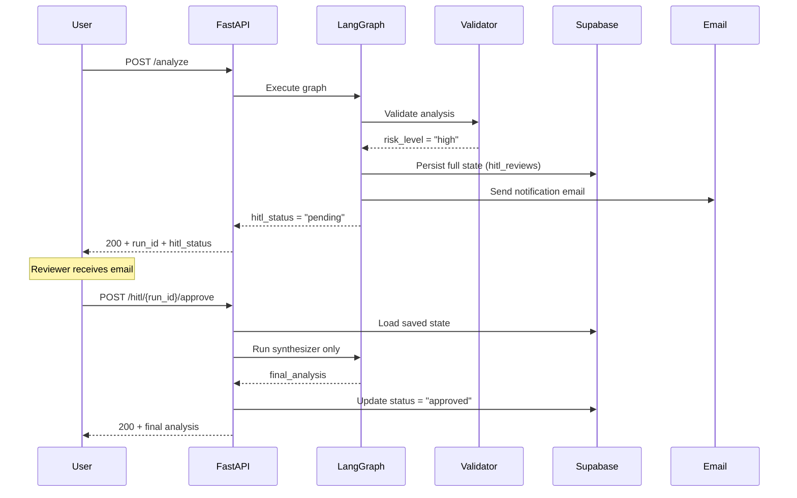

<div align="center">

# Technical Reference

[](technical-reference.md) [](technical-reference.pt-BR.md)

</div>

Deep-dive into the implementation details of the Theological LangGraph Agent. For the high-level overview see the [main README](../README.md).

---

## Table of Contents

- [LangGraph Implementation](#langgraph-implementation)
- [Model Strategy](#model-strategy)
- [Prompt Management & Resilience](#prompt-management--resilience)
- [Governance Layer](#governance-layer)
- [HITL Flow](#hitl-flow)
- [Database Schema](#database-schema)
- [Cache Service](#cache-service)
- [API Reference](#api-reference)
- [Deployment](#deployment)

---

## LangGraph Implementation

### Scatter-Gather Pattern

The system uses LangGraph's `Send` API to dispatch agents in parallel based on selected analysis modules:

```python
def router_function(state: TheologicalState):
    sends = [Send("intertextual_agent", state)]  # Always runs

    if "panorama" in state["selected_modules"]:
        sends.append(Send("panorama_agent", state))

    if "exegese" in state["selected_modules"]:
        sends.append(Send("lexical_agent", state))

    if "historical" in state["selected_modules"]:
        sends.append(Send("historical_agent", state))

    return sends  # All agents run in parallel
```

### State Management

Type-safe state using `TypedDict` with governance fields:

```python
class TheologicalState(TypedDict):
    # Input
    bible_book: str
    chapter: int
    verses: List[str]
    selected_modules: List[str]

    # Agent outputs
    panorama_content: Optional[str]
    lexical_content: Optional[str]
    historical_content: Optional[str]
    intertextual_content: Optional[str]
    validation_content: Optional[str]
    final_analysis: Optional[str]

    # Governance
    run_id: Optional[str]
    created_at: Optional[str]
    model_versions: Optional[dict]       # {"panorama_agent": "gemini-2.5-flash", ...}
    tokens_consumed: Optional[dict]      # {"panorama_agent": {"input": N, "output": M}, ...}
    reasoning_steps: Optional[list]      # Zero-cost metadata trail
    risk_level: Optional[str]            # "low" | "medium" | "high"
    hitl_status: Optional[str]           # None | "pending" | "approved" | "edited"
```

### DRY Node Pattern — `_build_node_result()`

All analysis nodes share the same governance return logic. Instead of repeating it in each node, we use a single helper:

```python
def _build_node_result(
    state, node_name, model_name, response, start_time,
    output_field, extra_fields=None, extra_reasoning=None,
) -> dict:
    # 1. Calculate duration + extract token usage
    # 2. Log structured event with run_id correlation
    # 3. Merge model_versions, tokens_consumed, reasoning_steps (immutable)
    # 4. Sanitize LLM output
    # 5. Return complete governance dict
```

**Before:** Each node was ~48 lines. **After:** Each node is ~20 lines.

Node example:
```python
def panorama_node(state: TheologicalState):
    start = time.time()
    model = get_panorama_model()
    # ... build prompt + messages ...
    response = model.invoke(messages)
    return _build_node_result(
        state, "panorama_agent", ModelTier.FLASH, response, start,
        output_field="panorama_content",
        raw_response=response,
    )
```

---

## Model Strategy

### 3-Tier Architecture

```
┌──────────────────────────────────────────────────────────────┐
│                     Model Assignment                          │
├─────────────────┬──────────────────────┬─────────────────────┤
│ LITE             │ FLASH                │ TOP                 │
│ flash-lite       │ 2.5-flash            │ 3-flash-preview     │
│ 10 RPM           │ 5 RPM                │ 5 RPM               │
├─────────────────┼──────────────────────┼─────────────────────┤
│ Intertextual     │ Panorama             │ Validator           │
│                  │ Lexical              │ Synthesizer         │
│                  │ Historical           │                     │
└─────────────────┴──────────────────────┴─────────────────────┘
```

### Fallback Chain

```
gemini-3-flash-preview → gemini-2.5-flash → gemini-2.5-flash-lite → gemini-2.0-flash-lite
```

If the primary model returns 429 (rate limited) or is deprecated, the client transparently falls to the next tier. The actual model used is recorded in `model_versions`.

### Temperature Settings

| Node | Temperature | Rationale |
|------|-------------|-----------|
| Lexical | 0.1 | Maximum precision for word study |
| Panorama | 0.2 | Balanced accuracy with context |
| Historical | 0.2 | Balanced accuracy with context |
| Intertextual | 0.2 | Balanced accuracy with context |
| Validator | 0.1 | Consistent risk assessment |
| Synthesizer | 0.4 | Creative synthesis with pastoral warmth |

---

## Prompt Management & Resilience

Prompt engineering is decoupled from the core logic via **LangSmith Prompt Hub**, ensuring agility without redeployment.

### Hybrid Execution Model

1. **Primary (Hub):** Node attempts to pull the latest published prompt from LangSmith.
2. **Fallback (Local JSON):** If the Hub call fails (network, 429, API key errors), it automatically degrades to a local JSON replica in `src/app/utils/fallbacks/`.
3. **Resilience Utility:** The `hub_fallback.py` utility manages this transition, ensuring the mandatory `GOOGLE_API_KEY` is preserved even when LangSmith's `secrets_from_env` fails.

### Version Tracking

Every prompt execution captures the **Prompt Commit Hash** to ensure full auditability:
- **Hub mode:** Extracts `lc_hub_commit_hash` from LangSmith's metadata.
- **Fallback mode:** Uses the hash stored in `prompts_fallback.json` during the last sync.
- **Propagation:** The hash is injected into `reasoning_steps` and structured logs.

### Synchronization Script

A utility script `sync_prompts.py` is used to update the local fallback cache:
- Extracts message templates and model configurations (temperature/model_name).
- Captures and stores the specific commit hash.
- **Frequency:** Highly recommended to run this script during CI/CD to ensure the local JSON reflects the latest production-approved prompts from the Hub.


---

## Governance Layer

### Token Tracking

Extracted from `usage_metadata` on every LLM response (zero additional API cost):

```python
def extract_token_usage(response) -> dict:
    if hasattr(response, "usage_metadata") and response.usage_metadata:
        return {
            "input": response.usage_metadata.input_tokens,
            "output": response.usage_metadata.output_tokens,
        }
    return {}
```

### Reasoning Steps Trail

Each node appends a reasoning step to the state:

```json
[
  {"node": "panorama_agent", "model": "gemini-2.5-flash", "tokens": {"input": 1200, "output": 3400}, "duration_ms": 8500},
  {"node": "lexical_agent", "model": "gemini-2.5-flash", "tokens": {"input": 980, "output": 4100}, "duration_ms": 12300},
  {"node": "theological_validator", "model": "gemini-3-flash-preview", "risk_level": "low", "alerts": [], "duration_ms": 6200}
]
```

### Structured Logging

JSON formatted logs with `run_id` correlation for tracing across nodes:

```json
{
  "timestamp": "2026-02-15T04:13:01Z",
  "level": "INFO",
  "logger": "app.agent.build",
  "message": "panorama_agent completed",
  "event": "node_complete",
  "node": "panorama_agent",
  "model": "gemini-2.5-flash",
  "prompt_commit_hash": "a7b2c...",
  "tokens": {"input": 1200, "output": 3400},
  "duration_ms": 8500,
  "run_id": "a1b2c3d4"
}
```

> **Live Example:** See [`samples/`](../samples/) for real-world input/output logs showing token usage and reasoning steps.
```

### Audit Service

Every analysis run is persisted to the `analysis_runs` table:
- Success: full metadata (tokens, models, duration, risk level)
- Failure: error message, traceback, partial metadata
- Uses UPSERT for idempotency (same `run_id` → update, not duplicate)

---

## HITL Flow

### Lifecycle



### Approve Endpoint

The approve endpoint reconstructs the agent state from the database and runs **only the synthesizer** — avoiding redundant re-execution of all agents:

```python
@router.post("/hitl/{run_id}/approve")
async def approve_review(run_id: str, body: HITLApproveRequest):
    # 1. Load review + content from DB
    # 2. Optionally apply edits
    # 3. Build LangGraph state from DB records
    # 4. Run synthesizer_node() only
    # 5. Update review status
    # 6. Return final analysis
```

---

## Database Schema

Four tables in Supabase PostgreSQL:

### `analysis_runs`
| Column | Type | Description |
|--------|------|-------------|
| `run_id` | VARCHAR(36) PK | UUID for each run |
| `book` | VARCHAR(50) | Bible book |
| `chapter` | INTEGER | Chapter number |
| `verses` | JSONB | Verse list |
| `modules` | JSONB | Selected modules |
| `status` | VARCHAR(20) | success / failure / hitl_pending |
| `tokens_consumed` | JSONB | Per-node token usage |
| `model_versions` | JSONB | Per-node model names |
| `duration_ms` | INTEGER | Total execution time |
| `error` | TEXT | Error message (failures only) |
| `created_at` | TIMESTAMPTZ | Run timestamp |

### `analysis_cache`
| Column | Type | Description |
|--------|------|-------------|
| `cache_key` | VARCHAR(64) PK | SHA-256 of input |
| `result` | JSONB | Cached response |
| `hit_count` | INTEGER | Atomic hit counter |
| `created_at` | TIMESTAMPTZ | Cache entry creation |
| `last_hit_at` | TIMESTAMPTZ | Last access time |

### `hitl_reviews`
| Column | Type | Description |
|--------|------|-------------|
| `run_id` | VARCHAR(36) PK | Links to analysis_runs |
| `status` | VARCHAR(20) | pending / approved / edited |
| `risk_level` | VARCHAR(10) | high / medium / low |
| `alerts` | JSONB | Validator alerts |
| `content` | JSONB | All agent outputs |
| `metadata` | JSONB | Model versions, tokens, reasoning |
| `created_at` | TIMESTAMPTZ | Review creation |
| `reviewed_at` | TIMESTAMPTZ | Review completion |

### `graph_run_traces`
| Column | Type | Description |
|--------|------|-------------|
| `run_id` | VARCHAR(36) UNIQUE FK | Links to `analysis_runs.run_id` |
| `langsmith_run_id` | VARCHAR(36) | LangSmith trace/run identifier |
| `storage_path` | TEXT | Object path in Supabase Storage |
| `size_bytes` | INTEGER | Stored trace file size |
| `status` | VARCHAR(20) | uploaded / failed / skipped |
| `error_message` | TEXT | Failure/skip reason when applicable |
| `created_at` | TIMESTAMPTZ | Trace record creation |

### Trace Export Runtime Behavior

- `POST /analyze` (success or HITL pending): trace export is scheduled as a FastAPI background task to reduce response latency.
- `POST /analyze` (HTTP 500 path): trace export is attempted synchronously before returning the error.
- Streamlit direct-call fallback (when API is unreachable): trace export is attempted synchronously on a best-effort basis.

---

## Cache Service

### Key Generation

```python
def _build_cache_key(book, chapter, verses, modules):
    raw = f"{book}:{chapter}:{sorted(verses)}:{sorted(modules)}"
    return hashlib.sha256(raw.encode()).hexdigest()
```

### Race-Condition Safety

Cache writes use `INSERT ... ON CONFLICT DO NOTHING` — if two identical requests run simultaneously, only the first write succeeds, and the second read gets the cached result.

Hit counting uses `UPDATE SET hit_count = hit_count + 1` (atomic PostgreSQL operation).

---

## API Reference

### POST /analyze

**Request:**
```json
{
  "book": "Sl",
  "chapter": 23,
  "verses": [1, 2, 3],
  "selected_modules": ["panorama", "exegese", "teologia"]
}
```

**Response (200):**
```json
{
  "final_analysis": "# Estudo Teológico...\n\n## Panorama...",
  "from_cache": false,
  "run_id": "a1b2c3d4-...",
  "tokens_consumed": {"panorama_agent": {"input": 1200, "output": 3400}},
  "model_versions": {"panorama_agent": "gemini-2.5-flash"},
  "risk_level": "low",
  "hitl_status": null
}
```

**Response (200 — HITL Pending):**
```json
{
  "final_analysis": "",
  "hitl_status": "pending",
  "run_id": "a1b2c3d4-...",
  "risk_level": "high"
}
```

### Input Validation (Pydantic)

- `book`: Sanitized (strip, title-case)
- `verses`: Deduplicated, sorted
- `selected_modules`: Must be subset of `["panorama", "exegese", "teologia"]`

---

## Deployment

### Dockerfile

```dockerfile
FROM python:3.12-slim
WORKDIR /app
COPY requirements-api.txt .
RUN pip install --no-cache-dir -r requirements-api.txt
COPY src/ ./src/
CMD uvicorn main:app --host 0.0.0.0 --port ${PORT} --app-dir src
```

### render.yaml

Render Blueprint with environment variables. Secrets (`sync: false`) must be set manually in the dashboard:

- `GOOGLE_API_KEY`, `DB_URL`, `LANGSMITH_API_KEY`, `SUPABASE_PROJECT`, `SUPABASE_SECRET_KEY`
- `SMTP_USER`, `SMTP_PASSWORD`, `HITL_REVIEWER_EMAIL`

### Keep-Alive (GitHub Actions)

```yaml
on:
  schedule:
    - cron: '*/14 * * * *'   # Every 14 minutes
jobs:
  ping:
    runs-on: ubuntu-latest
    steps:
      - run: curl -fsS "${{ secrets.RENDER_API_URL }}/health"
```

**Setup:** Add `RENDER_API_URL` secret in GitHub → Settings → Secrets → Actions.

### Environment Variables Reference

| Variable | Required | Description |
|----------|----------|-------------|
| `GOOGLE_API_KEY` | ✅ | Google Gemini API key |
| `DB_URL` | ✅ | Supabase PostgreSQL connection string |
| `SMTP_HOST` | ✅ | SMTP server (e.g. smtp.gmail.com) |
| `SMTP_PORT` | ✅ | SMTP port (587 for TLS) |
| `SMTP_USER` | ✅ | SMTP username / email |
| `SMTP_PASSWORD` | ✅ | Gmail App Password |
| `HITL_REVIEWER_EMAIL` | ✅ | Reviewer email for HITL alerts |
| `LANGSMITH_API_KEY` | ❌ | LangSmith tracing |
| `LANGCHAIN_TRACING_V2` | ❌ | Enable tracing (`true`) |
| `LANGCHAIN_PROJECT` | ❌ | LangSmith project name |
| `SUPABASE_PROJECT` | ❌ | Supabase project URL (for trace export) |
| `SUPABASE_SECRET_KEY` | ❌ | Supabase service role key (for trace export) |
| `SUPABASE_TRACES_BUCKET` | ❌ | Supabase bucket name for JSON traces (`traces` default) |
| `API_BASE_URL` | ❌ | Streamlit → API URL override |
