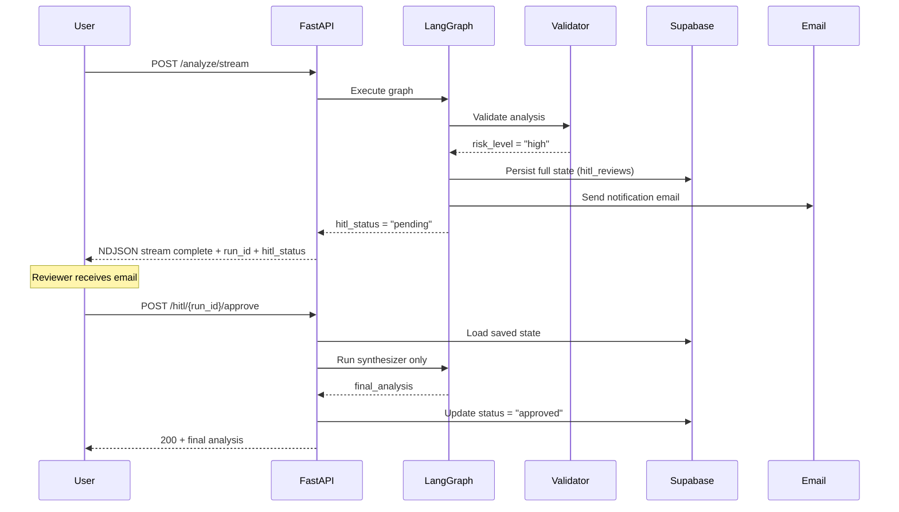

<div align="center">

# Technical Reference

[](technical-reference.md) [](technical-reference.pt-BR.md)

</div>

Deep-dive into the implementation details of the Theological LangGraph Agent. For the high-level overview see the [main README](../README.md).

---

## Table of Contents

- [Technical Reference](#technical-reference)
  - [Table of Contents](#table-of-contents)
  - [LangGraph Implementation](#langgraph-implementation)
    - [Scatter-Gather Pattern](#scatter-gather-pattern)
    - [State Management](#state-management)
    - [DRY Node Pattern — `_build_node_result()`](#dry-node-pattern--_build_node_result)
  - [Model Strategy](#model-strategy)
    - [Dynamic Model Selection](#dynamic-model-selection)
    - [Fallback Chain](#fallback-chain)
    - [Temperature Settings](#temperature-settings)
  - [Prompt Management \& Resilience](#prompt-management--resilience)
    - [Hybrid Execution Model (hub\_fallback.py)](#hybrid-execution-model-hub_fallbackpy)
    - [Version Tracking](#version-tracking)
  - [Governance Layer](#governance-layer)
    - [Token Tracking](#token-tracking)
    - [Audit Service](#audit-service)
  - [HITL Flow](#hitl-flow)
    - [Lifecycle](#lifecycle)
  - [Database Schema](#database-schema)
    - [`analysis_runs`](#analysis_runs)
  - [API Reference](#api-reference)
    - [POST /analyze/stream](#post-analyzestream)
  - [Deployment](#deployment)
    - [Dockerfile](#dockerfile)

---

## LangGraph Implementation

### Scatter-Gather Pattern

The system uses LangGraph's `Send` API to dispatch agents in parallel based on selected analysis modules:

```python
def router_function(state: TheologicalState):
    sends = [Send("intertextual_agent", state)]  # Always runs

    if "panorama" in state["selected_modules"]:
        sends.append(Send("panorama_agent", state))

    if "exegese" in state["selected_modules"]:
        sends.append(Send("lexical_agent", state))

    if "historical" in state["selected_modules"]:
        sends.append(Send("historical_agent", state))

    return sends  # All agents run in parallel
```

### State Management

Type-safe state using `TypedDict` with governance fields:

```python
class TheologicalState(TypedDict):
    # Input
    bible_book: str
    chapter: int
    verses: List[str]
    selected_modules: List[str]

    # Agent outputs
    panorama_content: Optional[str]
    lexical_content: Optional[str]
    historical_content: Optional[str]
    intertextual_content: Optional[str]
    validation_content: Optional[str]
    final_analysis: Optional[str]

    # Governance
    run_id: Optional[str]
    created_at: Optional[str]
    model_versions: Optional[dict]       # {"panorama_agent": "gemini-2.5-flash", ...}
    tokens_consumed: Optional[dict]      # {"panorama_agent": {"input": N, "output": M}, ...}
    reasoning_steps: Optional[list]      # Zero-cost metadata trail
    risk_level: Optional[str]            # "low" | "medium" | "high"
    hitl_status: Optional[str]           # None | "pending" | "approved" | "edited"
```

### DRY Node Pattern — `_build_node_result()`

All analysis nodes share the same governance return logic. Instead of repeating it in each node, we use a single helper:

```python
def _build_node_result(
    state, node_name, model_name, response, start_time,
    output_field, extra_fields=None, extra_reasoning=None,
) -> dict:
    # 1. Calculate duration + extract token usage
    # 2. Log structured event with run_id correlation
    # 3. Merge model_versions, tokens_consumed, reasoning_steps (immutable)
    # 4. Sanitize LLM output
    # 5. Return complete governance dict
```

Node example:
```python
def panorama_node(state: TheologicalState):
    start = time.time()
    response, raw, model_used, prompt_commit_hash = execute_with_fallback(
        prompt_name="theological-agent-panorama-prompt",
        format_vars={
            "livro": state["bible_book"],
            "capitulo": state["chapter"],
            "versiculos": " ".join(state["verses"]),
        },
    )

    return _build_node_result(
        state, "panorama_agent", model_used, response, start,
        output_field="panorama_content",
        raw_response=raw,
        prompt_commit_hash=prompt_commit_hash,
    )
```

---

## Model Strategy

### Dynamic Model Selection

The system no longer relies on hardcoded model tiers. Instead, model selection is decoupled from the core logic:

1.  **Prompt Metadata**: The `model_name` is defined directly in the LangSmith Hub prompt configuration.
2.  **Autonomous Fleet**: Different agents can use different models (e.g., Pro for validation, Lite for translation) based on their specific needs, configurable instantly in the Hub UI.
3.  **Governance logs**: The exact model version utilized is captured in the `model_versions` dictionary within the state for full traceability.

### Fallback Chain

Fallback is handled at prompt execution level by `execute_with_fallback(...)`:

1. Try LangSmith Hub (`pull_prompt(..., include_model=True)`).
2. On failure, use local `prompts_fallback.json`.
3. Return model + prompt version metadata in both paths.

### Temperature Settings

| Node | Temperature | Rationale |
|------|-------------|-----------|
| Lexical | 0.1 | Maximum precision for word study |
| Panorama | 0.2 | Balanced accuracy with context |
| Historical | 0.2 | Balanced accuracy with context |
| Intertextual | 0.2 | Balanced accuracy with context |
| Validator | 0.1 | Consistent risk assessment |
| Synthesizer | 0.4 | Creative synthesis with pastoral warmth |

---

## Prompt Management & Resilience

Prompt engineering is decoupled from the core logic via **LangSmith Prompt Hub**, ensuring agility without redeployment.

### Hybrid Execution Model (hub_fallback.py)

1. **Primary (Hub):** Node attempts to pull the latest published prompt template from LangSmith.
2. **Fallback (Local JSON):** If the Hub call fails (network, 429, API key errors), it automatically degrades to a local JSON replica in `src/app/utils/fallbacks/prompts_fallback.json`.
3. **Resilience Utility:** The `hub_fallback.py` utility manages this transition, ensuring the mandatory `GOOGLE_API_KEY` is preserved even when LangSmith's internal logic fails.

### Version Tracking

Every prompt execution captures the **Prompt Commit Hash** to ensure full auditability:
- **Hub mode:** Extracts `lc_hub_commit_hash` from LangSmith's metadata.
- **Fallback mode:** Uses the hash stored in `prompts_fallback.json` during the last sync.
- **Propagation:** The hash is injected into `reasoning_steps` and structured logs.

---

## Governance Layer

### Token Tracking

Extracted from `usage_metadata` on every LLM response (zero additional API cost):

```python
def extract_token_usage(response) -> dict:
    if hasattr(response, "usage_metadata") and response.usage_metadata:
        return {
            "input": response.usage_metadata.input_tokens,
            "output": response.usage_metadata.output_tokens,
        }
    return {}
```

### Audit Service

Every analysis run is persisted to the `analysis_runs` table:
- Success/Failure flags (`success` boolean).
- Full metadata (tokens, models, duration, risk level).
- Uses UPSERT for idempotency.

---

## HITL Flow

### Lifecycle


```mermaid
sequenceDiagram
    participant U as User
    participant API as FastAPI
    participant G as LangGraph
    participant V as Validator
    participant DB as Supabase
    participant E as Email

    U->>API: POST /analyze/stream
    API->>G: Execute graph
    G->>V: Validate analysis
    V-->>G: risk_level = "high"
    G->>DB: Persist full state (hitl_reviews)
    G->>E: Send notification email
    G-->>API: hitl_status = "pending"
    API-->>U: NDJSON stream complete + run_id + hitl_status

    Note over U: Reviewer receives email

    U->>API: POST /hitl/{run_id}/approve
    API->>DB: Load saved state
    API->>G: Run synthesizer only
    G-->>API: final_analysis
    API->>DB: Update status = "approved"
    API-->>U: 200 + final analysis
```

---

## Database Schema

### `analysis_runs`
| Column | Type | Description |
|--------|------|-------------|
| `run_id` | VARCHAR(36) PK | UUID for each run |
| `book` | VARCHAR(10) | Bible book abbreviation |
| `chapter` | INTEGER | Chapter number |
| `verses` | INTEGER[] | Verse list |
| `selected_modules` | TEXT[] | Selected modules |
| `model_versions` | JSONB | Per-node model names |
| `prompt_versions` | JSONB | Per-node prompt commit versions |
| `tokens_consumed` | JSONB | Per-node token usage |
| `reasoning_steps` | JSONB | Node-level reasoning/telemetry trail |
| `risk_level` | VARCHAR(10) | low / medium / high |
| `success` | BOOLEAN | Whether the run completed successfully |
| `hitl_status` | VARCHAR(20) | pending / approved / edited / null |
| `duration_ms` | INTEGER | Total execution time |
| `final_analysis` | TEXT | Final generated analysis |
| `error` | TEXT | Error message (failures only) |
| `created_at` | TIMESTAMPTZ | Run timestamp |

---

## API Reference

### POST /analyze/stream

**Request:**
```json
{
  "book": "Sl",
  "chapter": 23,
  "verses": [1, 2, 3],
  "selected_modules": ["panorama", "exegese", "historical"]
}
```

**Response (NDJSON stream):**
Streaming newline-delimited JSON events with progress updates. Final event includes analysis result and governance metadata.

---

## Deployment

### Dockerfile

```dockerfile
FROM python:3.12-slim
WORKDIR /app
COPY requirements-api.txt .
RUN pip install --no-cache-dir -r requirements-api.txt
COPY src/ ./src/
CMD uvicorn main:app --host 0.0.0.0 --port ${PORT} --app-dir src
```
