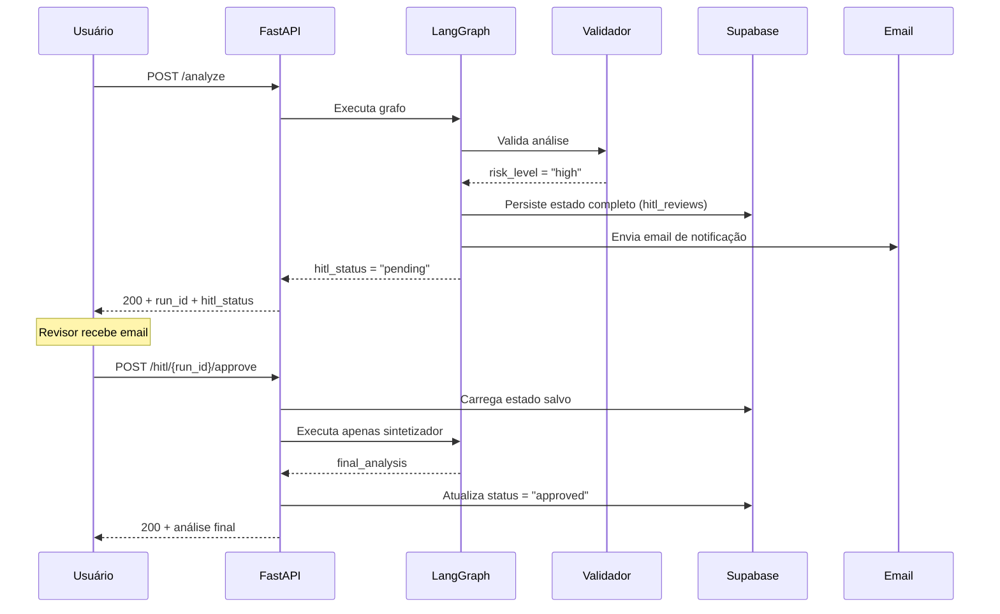

<div align="center">

# Referência Técnica

[](technical-reference.md) [](technical-reference.pt-BR.md)

</div>

Deep-dive nos detalhes de implementação do Theological LangGraph Agent. Para a visão geral, veja o [README principal](../README.pt-BR.md).

---

## Índice

- [Implementação LangGraph](#implementação-langgraph)
- [Estratégia de Modelos](#estratégia-de-modelos)
- [Gerenciamento de Prompts e Resiliência](#gerenciamento-de-prompts-e-resiliência)
- [Camada de Governança](#camada-de-governança)
- [Fluxo HITL](#fluxo-hitl)
- [Schema do Banco de Dados](#schema-do-banco-de-dados)
- [Serviço de Cache](#serviço-de-cache)
- [Referência da API](#referência-da-api)
- [Deploy](#deploy)

---

## Implementação LangGraph

### Padrão Scatter-Gather

O sistema usa a API `Send` do LangGraph para despachar agentes em paralelo baseado nos módulos de análise selecionados:

```python
def router_function(state: TheologicalState):
    sends = [Send("intertextual_agent", state)]  # Sempre executa

    if "panorama" in state["selected_modules"]:
        sends.append(Send("panorama_agent", state))

    if "exegese" in state["selected_modules"]:
        sends.append(Send("lexical_agent", state))

    if "historical" in state["selected_modules"]:
        sends.append(Send("historical_agent", state))

    return sends  # Todos os agentes executam em paralelo
```

### Gerenciamento de Estado

Estado tipado usando `TypedDict` com campos de governança:

```python
class TheologicalState(TypedDict):
    # Entrada
    bible_book: str
    chapter: int
    verses: List[str]
    selected_modules: List[str]

    # Saídas dos agentes
    panorama_content: Optional[str]
    lexical_content: Optional[str]
    historical_content: Optional[str]
    intertextual_content: Optional[str]
    validation_content: Optional[str]
    final_analysis: Optional[str]

    # Governança
    run_id: Optional[str]
    created_at: Optional[str]
    model_versions: Optional[dict]       # {"panorama_agent": "gemini-2.5-flash", ...}
    tokens_consumed: Optional[dict]      # {"panorama_agent": {"input": N, "output": M}, ...}
    reasoning_steps: Optional[list]      # Trilha de metadados a custo zero
    risk_level: Optional[str]            # "low" | "medium" | "high"
    hitl_status: Optional[str]           # None | "pending" | "approved" | "edited"
```

### Padrão DRY dos Nós — `_build_node_result()`

Todos os nós de análise compartilham a mesma lógica de retorno de governança. Em vez de repetir em cada nó, usamos um único helper:

```python
def _build_node_result(
    state, node_name, model_name, response, start_time,
    output_field, extra_fields=None, extra_reasoning=None,
) -> dict:
    # 1. Calcula duração + extrai uso de tokens
    # 2. Log estruturado com correlação run_id
    # 3. Merge de model_versions, tokens_consumed, reasoning_steps (imutável)
    # 4. Sanitiza output do LLM
    # 5. Retorna dict completo de governança
```

**Antes:** Cada nó tinha ~48 linhas. **Depois:** Cada nó tem ~20 linhas.

Exemplo de nó:
```python
def panorama_node(state: TheologicalState):
    start = time.time()
    model = get_panorama_model()
    # ... constrói prompt + mensagens ...
    response = model.invoke(messages)
    return _build_node_result(
        state, "panorama_agent", ModelTier.FLASH, response, start,
        output_field="panorama_content",
        raw_response=response,
    )
```

---

## Estratégia de Modelos

### Arquitetura em 3 Camadas

```
┌──────────────────────────────────────────────────────────────┐
│                   Atribuição de Modelos                       │
├─────────────────┬──────────────────────┬─────────────────────┤
│ LITE             │ FLASH                │ TOP                 │
│ flash-lite       │ 2.5-flash            │ 3-flash-preview     │
│ 10 RPM           │ 5 RPM                │ 5 RPM               │
├─────────────────┼──────────────────────┼─────────────────────┤
│ Intertextual     │ Panorama             │ Validador           │
│                  │ Léxico               │ Sintetizador        │
│                  │ Histórico            │                     │
└─────────────────┴──────────────────────┴─────────────────────┘
```

### Cadeia de Fallback

```
gemini-3-flash-preview → gemini-2.5-flash → gemini-2.5-flash-lite → gemini-2.0-flash-lite
```

Se o modelo primário retorna 429 (rate limited) ou está depreciado, o cliente migra automaticamente para o próximo tier. O modelo efetivamente utilizado é registrado em `model_versions`.

### Configurações de Temperatura

| Nó | Temperatura | Justificativa |
|----|-------------|---------------|
| Léxico | 0.1 | Precisão máxima para estudo de palavras |
| Panorama | 0.2 | Equilíbrio entre acurácia e contexto |
| Histórico | 0.2 | Equilíbrio entre acurácia e contexto |
| Intertextual | 0.2 | Equilíbrio entre acurácia e contexto |
| Validador | 0.1 | Avaliação de risco consistente |
| Sintetizador | 0.4 | Síntese criativa com calor pastoral |

---

## Gerenciamento de Prompts e Resiliência

A engenharia de prompts é desacoplada da lógica core via **LangSmith Prompt Hub**, garantindo agilidade sem necessidade de redeploy.

### Modelo de Execução Híbrido

1. **Primário (Hub):** O nó tenta baixar o prompt publicado mais recente do LangSmith.
2. **Fallback (JSON Local):** Se a chamada ao Hub falhar (rede, 429, erros de chave de API), o sistema degrada automaticamente para uma réplica JSON local em `src/app/utils/fallbacks/`.
3. **Utilitário de Resiliência:** O utilitário `hub_fallback.py` gerencia essa transição, garantindo que a `GOOGLE_API_KEY` obrigatória seja preservada mesmo quando o `secrets_from_env` do LangSmith falha.

### Rastreamento de Versão

Cada execução de prompt captura o **Hash de Commit do Prompt** para garantir auditabilidade total:
- **Modo Hub:** Extrai o `lc_hub_commit_hash` dos metadados do LangSmith.
- **Modo Fallback:** Usa o hash armazenado no `prompts_fallback.json` durante a última sincronização.
- **Propagação:** O hash é injetado nos `reasoning_steps` e nos logs estruturados.

### Script de Sincronização

Um script utilitário `sync_prompts.py` é usado para atualizar o cache de fallback local:
- Extrai templates de mensagens e configurações de modelo (temperatura/model_name).
- Captura e armazena o hash de commit específico.
- **Frequência:** Altamente recomendado executar este script durante o CI/CD para garantir que o JSON local reflita os prompts mais recentes aprovados em produção no Hub.


---

## Camada de Governança

### Rastreamento de Tokens

Extraído do `usage_metadata` em cada resposta do LLM (custo zero adicional):

```python
def extract_token_usage(response) -> dict:
    if hasattr(response, "usage_metadata") and response.usage_metadata:
        return {
            "input": response.usage_metadata.input_tokens,
            "output": response.usage_metadata.output_tokens,
        }
    return {}
```

### Trilha de Raciocínio (Reasoning Steps)

Cada nó adiciona um passo de raciocínio ao estado:

```json
[
  {"node": "panorama_agent", "model": "gemini-2.5-flash", "tokens": {"input": 1200, "output": 3400}, "duration_ms": 8500},
  {"node": "lexical_agent", "model": "gemini-2.5-flash", "tokens": {"input": 980, "output": 4100}, "duration_ms": 12300},
  {"node": "theological_validator", "model": "gemini-3-flash-preview", "risk_level": "low", "alerts": [], "duration_ms": 6200}
]
```

### Logging Estruturado

Logs formatados em JSON com correlação `run_id` para rastreamento entre nós:

```json
{
  "timestamp": "2026-02-15T04:13:01Z",
  "level": "INFO",
  "logger": "app.agent.build",
  "message": "panorama_agent completed",
  "event": "node_complete",
  "node": "panorama_agent",
  "model": "gemini-2.5-flash",
  "prompt_commit_hash": "a7b2c...",
  "tokens": {"input": 1200, "output": 3400},
  "duration_ms": 8500,
  "run_id": "a1b2c3d4"
}
```

> **Exemplo Real:** Veja [`samples/`](../samples/) para logs de entrada/saída reais mostrando uso de tokens e passos de raciocínio.
```

### Serviço de Auditoria

Todo run de análise é persistido na tabela `analysis_runs`:
- Sucesso: metadados completos (tokens, modelos, duração, nível de risco)
- Falha: mensagem de erro, traceback, metadados parciais
- Usa UPSERT para idempotência (mesmo `run_id` → atualiza, não duplica)

---

## Fluxo HITL

### Ciclo de Vida



### Endpoint de Aprovação

O endpoint de aprovação reconstrói o estado do agente a partir do banco de dados e executa **apenas o sintetizador** — evitando re-execução redundante de todos os agentes:

```python
@router.post("/hitl/{run_id}/approve")
async def approve_review(run_id: str, body: HITLApproveRequest):
    # 1. Carrega revisão + conteúdo do DB
    # 2. Opcionalmente aplica edições
    # 3. Constrói estado LangGraph dos registros do DB
    # 4. Executa synthesizer_node() apenas
    # 5. Atualiza status da revisão
    # 6. Retorna análise final
```

---

## Schema do Banco de Dados

Três tabelas no Supabase PostgreSQL, criadas de forma idempotente na inicialização da aplicação:

### `analysis_runs`
| Coluna | Tipo | Descrição |
|--------|------|-----------|
| `run_id` | VARCHAR(36) PK | UUID de cada execução |
| `book` | VARCHAR(50) | Livro bíblico |
| `chapter` | INTEGER | Número do capítulo |
| `verses` | JSONB | Lista de versículos |
| `modules` | JSONB | Módulos selecionados |
| `status` | VARCHAR(20) | success / failure / hitl_pending |
| `tokens_consumed` | JSONB | Uso de tokens por nó |
| `model_versions` | JSONB | Nomes de modelo por nó |
| `duration_ms` | INTEGER | Tempo total de execução |
| `error` | TEXT | Mensagem de erro (apenas falhas) |
| `created_at` | TIMESTAMPTZ | Timestamp da execução |

### `analysis_cache`
| Coluna | Tipo | Descrição |
|--------|------|-----------|
| `cache_key` | VARCHAR(64) PK | SHA-256 da entrada |
| `result` | JSONB | Resposta cacheada |
| `hit_count` | INTEGER | Contador atômico de hits |
| `created_at` | TIMESTAMPTZ | Criação da entrada de cache |
| `last_hit_at` | TIMESTAMPTZ | Último acesso |

### `hitl_reviews`
| Coluna | Tipo | Descrição |
|--------|------|-----------|
| `run_id` | VARCHAR(36) PK | Link para analysis_runs |
| `status` | VARCHAR(20) | pending / approved / edited |
| `risk_level` | VARCHAR(10) | high / medium / low |
| `alerts` | JSONB | Alertas do validador |
| `content` | JSONB | Todas as saídas dos agentes |
| `metadata` | JSONB | Versões de modelo, tokens, raciocínio |
| `created_at` | TIMESTAMPTZ | Criação da revisão |
| `reviewed_at` | TIMESTAMPTZ | Conclusão da revisão |

---

## Serviço de Cache

### Geração de Chave

```python
def _build_cache_key(book, chapter, verses, modules):
    raw = f"{book}:{chapter}:{sorted(verses)}:{sorted(modules)}"
    return hashlib.sha256(raw.encode()).hexdigest()
```

### Segurança contra Race Conditions

Escritas no cache usam `INSERT ... ON CONFLICT DO NOTHING` — se duas requisições idênticas executam simultaneamente, apenas a primeira escrita é aceita, e a segunda leitura obtém o resultado cacheado.

A contagem de hits usa `UPDATE SET hit_count = hit_count + 1` (operação atômica do PostgreSQL).

---

## Referência da API

### POST /analyze

**Requisição:**
```json
{
  "book": "Sl",
  "chapter": 23,
  "verses": [1, 2, 3],
  "selected_modules": ["panorama", "exegese", "teologia"]
}
```

**Resposta (200):**
```json
{
  "final_analysis": "# Estudo Teológico...\n\n## Panorama...",
  "from_cache": false,
  "run_id": "a1b2c3d4-...",
  "tokens_consumed": {"panorama_agent": {"input": 1200, "output": 3400}},
  "model_versions": {"panorama_agent": "gemini-2.5-flash"},
  "risk_level": "low",
  "hitl_status": null
}
```

**Resposta (200 — HITL Pendente):**
```json
{
  "final_analysis": "",
  "hitl_status": "pending",
  "run_id": "a1b2c3d4-...",
  "risk_level": "high"
}
```

### Validação de Input (Pydantic)

- `book`: Sanitizado (strip, title-case)
- `verses`: Deduplicados, ordenados
- `selected_modules`: Deve ser subconjunto de `["panorama", "exegese", "teologia"]`

---

## Deploy

### Dockerfile

```dockerfile
FROM python:3.12-slim
WORKDIR /app
COPY requirements-api.txt .
RUN pip install --no-cache-dir -r requirements-api.txt
COPY src/ ./src/
CMD uvicorn main:app --host 0.0.0.0 --port ${PORT} --app-dir src
```

### render.yaml

Blueprint do Render com variáveis de ambiente. Secrets (`sync: false`) devem ser configurados manualmente no dashboard:

- `GOOGLE_API_KEY`, `DB_URL`, `LANGSMITH_API_KEY`
- `SMTP_USER`, `SMTP_PASSWORD`, `HITL_REVIEWER_EMAIL`

### Keep-Alive (GitHub Actions)

```yaml
on:
  schedule:
    - cron: '*/14 * * * *'   # A cada 14 minutos
jobs:
  ping:
    runs-on: ubuntu-latest
    steps:
      - run: curl -fsS "${{ secrets.RENDER_API_URL }}/health"
```

**Configuração:** Adicione `RENDER_API_URL` como secret em GitHub → Settings → Secrets → Actions.

### Referência de Variáveis de Ambiente

| Variável | Obrigatória | Descrição |
|----------|-------------|-----------|
| `GOOGLE_API_KEY` | ✅ | Chave da API Google Gemini |
| `DB_URL` | ✅ | String de conexão PostgreSQL Supabase |
| `SMTP_HOST` | ✅ | Servidor SMTP (ex: smtp.gmail.com) |
| `SMTP_PORT` | ✅ | Porta SMTP (587 para TLS) |
| `SMTP_USER` | ✅ | Usuário / email SMTP |
| `SMTP_PASSWORD` | ✅ | App Password do Gmail |
| `HITL_REVIEWER_EMAIL` | ✅ | Email do revisor para alertas HITL |
| `LANGSMITH_API_KEY` | ❌ | Tracing via LangSmith |
| `LANGCHAIN_TRACING_V2` | ❌ | Ativar tracing (`true`) |
| `LANGCHAIN_PROJECT` | ❌ | Nome do projeto no LangSmith |
| `API_BASE_URL` | ❌ | Override da URL Streamlit → API |
