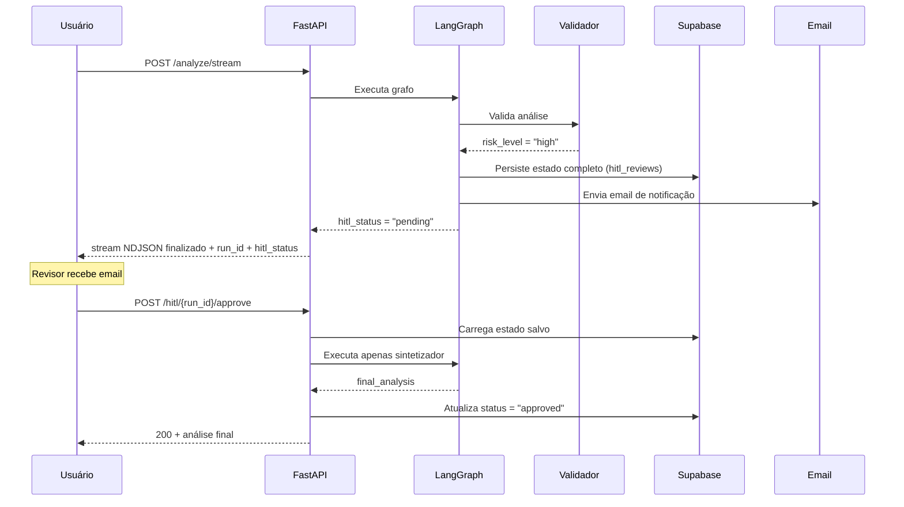

<div align="center">

# Referência Técnica

[](technical-reference.md) [](technical-reference.pt-BR.md)

</div>

Deep-dive nos detalhes de implementação do Theological LangGraph Agent. Para a visão geral, veja o [README principal](../README.pt-BR.md).

---

## Índice

- [Referência Técnica](#referência-técnica)
  - [Índice](#índice)
  - [Implementação LangGraph](#implementação-langgraph)
    - [Padrão Scatter-Gather](#padrão-scatter-gather)
    - [Gerenciamento de Estado](#gerenciamento-de-estado)
    - [Padrão DRY dos Nós — `_build_node_result()`](#padrão-dry-dos-nós--_build_node_result)
  - [Estratégia de Modelos](#estratégia-de-modelos)
    - [Seleção Dinâmica de Modelos](#seleção-dinâmica-de-modelos)
    - [Configurações de Temperatura](#configurações-de-temperatura)
  - [Gerenciamento de Prompts e Resiliência](#gerenciamento-de-prompts-e-resiliência)
    - [Modelo de Execução Híbrido (hub\_fallback.py)](#modelo-de-execução-híbrido-hub_fallbackpy)
  - [Camada de Governança](#camada-de-governança)
    - [Rastreamento de Tokens](#rastreamento-de-tokens)
    - [Serviço de Auditoria](#serviço-de-auditoria)
  - [Fluxo HITL](#fluxo-hitl)
    - [Ciclo de Vida](#ciclo-de-vida)
  - [Schema do Banco de Dados](#schema-do-banco-de-dados)
    - [`analysis_runs`](#analysis_runs)
  - [Referência da API](#referência-da-api)
    - [POST /analyze/stream](#post-analyzestream)
  - [Deploy](#deploy)
    - [Dockerfile](#dockerfile)

---

## Implementação LangGraph

### Padrão Scatter-Gather

O sistema usa a API `Send` do LangGraph para despachar agentes em paralelo baseado nos módulos de análise selecionados:

```python
def router_function(state: TheologicalState):
    sends = [Send("intertextual_agent", state)]  # Sempre executa

    if "panorama" in state["selected_modules"]:
        sends.append(Send("panorama_agent", state))

    if "exegese" in state["selected_modules"]:
        sends.append(Send("lexical_agent", state))

    if "historical" in state["selected_modules"]:
        sends.append(Send("historical_agent", state))

    return sends  # Todos os agentes executam em paralelo
```

### Gerenciamento de Estado

Estado tipado usando `TypedDict` com campos de governança:

```python
class TheologicalState(TypedDict):
    # Entrada
    bible_book: str
    chapter: int
    verses: List[str]
    selected_modules: List[str]

    # Saídas dos agentes
    panorama_content: Optional[str]
    lexical_content: Optional[str]
    historical_content: Optional[str]
    intertextual_content: Optional[str]
    validation_content: Optional[str]
    final_analysis: Optional[str]

    # Governança
    run_id: Optional[str]
    created_at: Optional[str]
    model_versions: Optional[dict]       # {"panorama_agent": "gemini-2.5-flash", ...}
    tokens_consumed: Optional[dict]      # {"panorama_agent": {"input": N, "output": M}, ...}
    reasoning_steps: Optional[list]      # Trilha de metadados a custo zero
    risk_level: Optional[str]            # "low" | "medium" | "high"
    hitl_status: Optional[str]           # None | "pending" | "approved" | "edited"
```

### Padrão DRY dos Nós — `_build_node_result()`

Todos os nós de análise compartilham a mesma lógica de retorno de governança. Em vez de repetir em cada nó, usamos um único helper:

```python
def _build_node_result(
    state, node_name, model_name, response, start_time,
    output_field, extra_fields=None, extra_reasoning=None,
) -> dict:
    # 1. Calcula duração + extrai uso de tokens
    # 2. Log estruturado com correlação run_id
    # 3. Merge de model_versions, tokens_consumed, reasoning_steps (imutável)
    # 4. Sanitiza output do LLM
    # 5. Retorna dict completo de governança
```

Exemplo de nó:
```python
def panorama_node(state: TheologicalState):
    start = time.time()
    response, raw, model_used, prompt_commit_hash = execute_with_fallback(
        prompt_name="theological-agent-panorama-prompt",
        format_vars={
            "livro": state["bible_book"],
            "capitulo": state["chapter"],
            "versiculos": " ".join(state["verses"]),
        },
    )

    return _build_node_result(
        state, "panorama_agent", model_used, response, start,
        output_field="panorama_content",
        raw_response=raw,
        prompt_commit_hash=prompt_commit_hash,
    )
```

---

## Estratégia de Modelos

### Seleção Dinâmica de Modelos

O sistema não depende mais de camadas (tiers) hardcoded. A seleção é desacoplada da lógica core:

1.  **Metadados do Prompt**: O `model_name` é definido diretamente na configuração do prompt no LangSmith Hub.
2.  **Frota Autônoma**: Diferentes agentes podem usar modelos distintos baseados em sua necessidade (ex: Pro para validação, Lite para tradução), configuráveis instantaneamente via UI.
3.  **Logs de Governança**: A versão exata do modelo utilizada é capturada no dicionário `model_versions` no estado.

### Configurações de Temperatura

| Nó | Temperatura | Justificativa |
|----|-------------|---------------|
| Léxico | 0.1 | Precisão máxima para estudo de palavras |
| Panorama | 0.2 | Equilíbrio entre acurácia e contexto |
| Histórico | 0.2 | Equilíbrio entre acurácia e contexto |
| Intertextual | 0.2 | Equilíbrio entre acurácia e contexto |
| Validador | 0.1 | Avaliação de risco consistente |
| Sintetizador | 0.4 | Síntese criativa com calor pastoral |

---

## Gerenciamento de Prompts e Resiliência

A engenharia de prompts é desacoplada da lógica core via **LangSmith Prompt Hub**, garantindo agilidade sem necessidade de redeploy.

### Modelo de Execução Híbrido (hub_fallback.py)

1. **Primário (Hub):** O nó tenta baixar o prompt publicado mais recente do LangSmith.
2. **Fallback (JSON Local):** Se a chamada ao Hub falhar (rede, 429, erros de chave de API), o sistema degrada automaticamente para uma réplica JSON local em `src/app/utils/fallbacks/prompts_fallback.json`.
3. **Utilitário de Resiliência:** O utilitário `hub_fallback.py` gerencia essa transição, garantindo que a `GOOGLE_API_KEY` obrigatória seja preservada.

### Rastreamento de Versões (Version Tracking)

Cada execução de prompt captura o **Hash do Commit do Prompt** para garantir auditabilidade completa:
- **Modo Hub:** Extrai `lc_hub_commit_hash` dos metadados do LangSmith.
- **Modo Fallback:** Usa o hash armazenado em `prompts_fallback.json` durante a última sincronização.
- **Propagação:** O hash é injetado nos `reasoning_steps` e logs estruturados.

---

## Camada de Governança

### Rastreamento de Tokens

Extraído do `usage_metadata` em cada resposta do LLM (custo zero adicional).

### Serviço de Auditoria

Todo run de análise é persistido na tabela `analysis_runs`:
- Flag de sucesso (`success` boolean).
- Metadados completos (tokens, modelos, duração, nível de risco).
- Usa UPSERT para idempotência.

---

## Fluxo HITL

### Ciclo de Vida


```mermaid
sequenceDiagram
    participant U as Usuário
    participant API as FastAPI
    participant G as LangGraph
    participant V as Validador
    participant DB as Supabase
    participant E as Email

    U->>API: POST /analyze/stream
    API->>G: Executa grafo
    G->>V: Valida análise
    V-->>G: risk_level = "high"
    G->>DB: Persiste estado completo (hitl_reviews)
    G->>E: Envia email de notificação
    G-->>API: hitl_status = "pending"
    API-->>U: stream NDJSON finalizado + run_id + hitl_status

    Note over U: Revisor recebe email

    U->>API: POST /hitl/{run_id}/approve
    API->>DB: Carrega estado salvo
    API->>G: Executa apenas sintetizador
    G-->>API: final_analysis
    API->>DB: Atualiza status = "approved"
    API-->>U: 200 + análise final
```

---

## Schema do Banco de Dados

### `analysis_runs`
| Coluna | Tipo | Descrição |
|--------|------|-------------|
| `run_id` | VARCHAR(36) PK | UUID de cada execução |
| `book` | VARCHAR(10) | Abreviação do livro bíblico |
| `chapter` | INTEGER | Número do capítulo |
| `verses` | INTEGER[] | Lista de versículos |
| `selected_modules` | TEXT[] | Módulos selecionados |
| `model_versions` | JSONB | Modelos usados por nó |
| `prompt_versions` | JSONB | Versões (commit hash) dos prompts por nó |
| `tokens_consumed` | JSONB | Uso de tokens por nó |
| `reasoning_steps` | JSONB | Trilha de telemetria/raciocínio por nó |
| `risk_level` | VARCHAR(10) | low / medium / high |
| `success` | BOOLEAN | Indica se o run completou com sucesso |
| `hitl_status` | VARCHAR(20) | pending / approved / edited / null |
| `duration_ms` | INTEGER | Tempo total de execução |
| `final_analysis` | TEXT | Análise final gerada |
| `error` | TEXT | Mensagem de erro (apenas falhas) |
| `created_at` | TIMESTAMPTZ | Timestamp da execução |

---

## Referência da API

### POST /analyze/stream

**Requisição:**
```json
{
  "book": "Sl",
  "chapter": 23,
  "verses": [1, 2, 3],
  "selected_modules": ["panorama", "exegese", "historical"]
}
```

**Resposta (stream NDJSON):**
Stream de eventos JSON delimitados por nova linha com atualizações de progresso. O evento final inclui resultado e metadados de governança.

---

## Deploy

### Dockerfile

```dockerfile
FROM python:3.12-slim
WORKDIR /app
COPY requirements-api.txt .
RUN pip install --no-cache-dir -r requirements-api.txt
COPY src/ ./src/
CMD uvicorn main:app --host 0.0.0.0 --port ${PORT} --app-dir src
```
